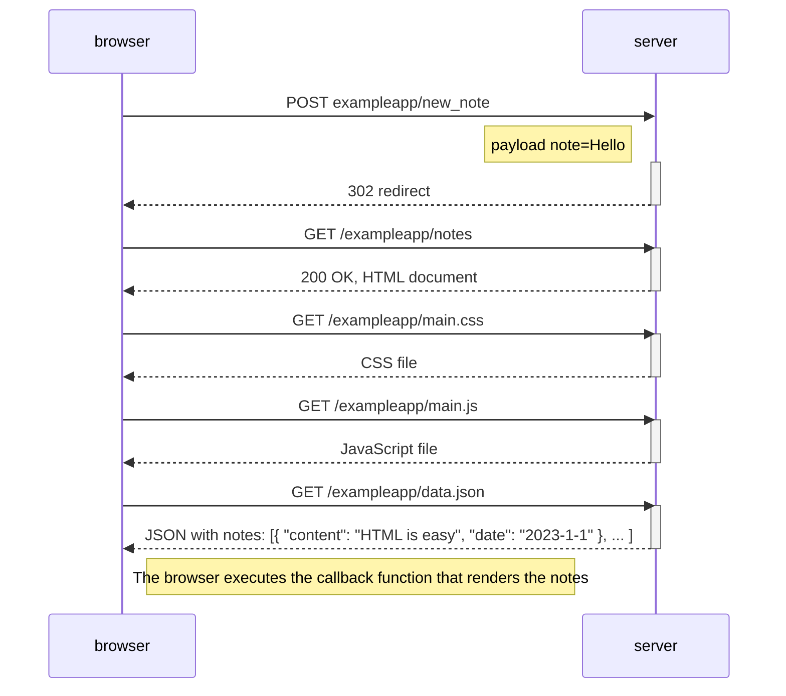

```mermaid
sequenceDiagram
    participant browser
    participant server

    browser->>server: POST exampleapp/new_note 
    Note left of server: payload note=Hello
    activate server
    server-->>browser: 302 redirect
    deactivate server
   
    browser->>server: GET /exampleapp/notes
    activate server
    server-->>browser: 200 OK, HTML document
    deactivate server

    browser->>server: GET /exampleapp/main.css
    activate server
    server-->>browser: CSS file
    deactivate server

    browser->>server: GET /exampleapp/main.js
    activate server
    server-->>browser: JavaScript file
    deactivate server

    
    browser->>server: GET /exampleapp/data.json
    activate server
    server-->>browser: JSON with notes: [{ "content": "HTML is easy", "date": "2023-1-1" }, ... ]
    deactivate server

    Note right of browser: The browser executes the callback function that renders the notes
```
