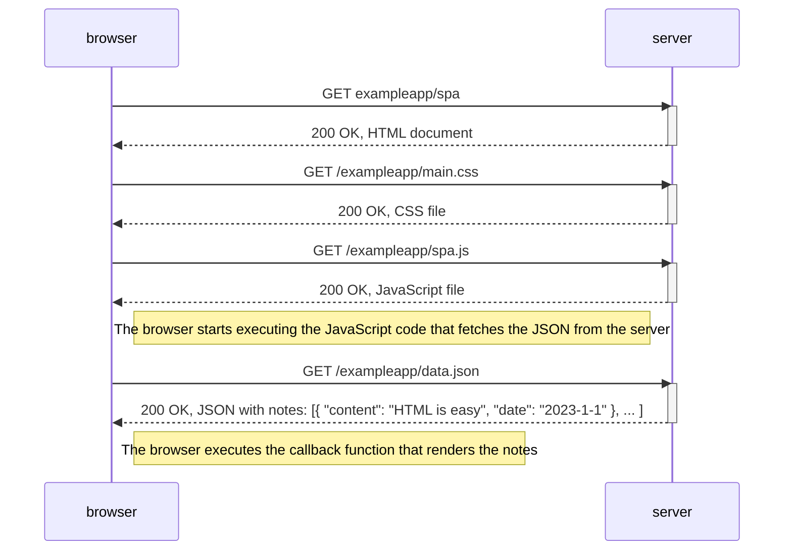

```mermaid
sequenceDiagram
    participant browser
    participant server

    browser->>server: GET exampleapp/spa
    activate server
    server-->>browser: 200 OK, HTML document
    deactivate server

    browser->>server: GET /exampleapp/main.css
    activate server
    server-->>browser: 200 OK, CSS file
    deactivate server

    browser->>server: GET /exampleapp/spa.js
    activate server
    server-->>browser: 200 OK, JavaScript file
    deactivate server

    Note right of browser: The browser starts executing the JavaScript code that fetches the JSON from the server

    browser->>server: GET /exampleapp/data.json
    activate server
    server-->>browser: 200 OK, JSON with notes: [{ "content": "HTML is easy", "date": "2023-1-1" }, ... ]
    deactivate server

    Note right of browser: The browser executes the callback function that renders the notes
```
