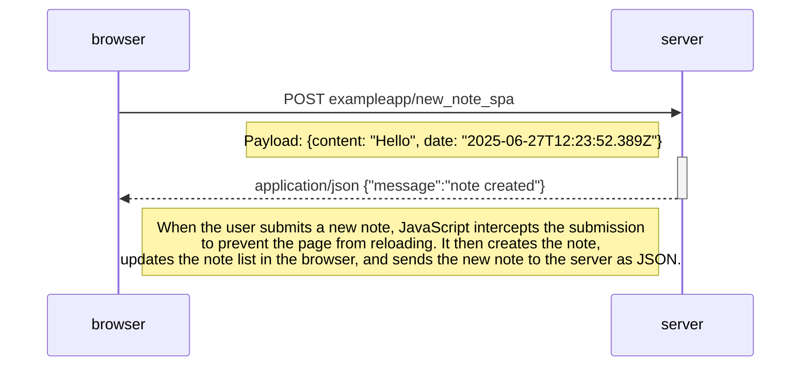

```mermaid
sequenceDiagram
    participant browser
    participant server

    browser->>server: POST exampleapp/new_note_spa
    Note left of server: Payload: {content: "Hello", date: "2025-06-27T12:23:52.389Z"}
    activate server
    server-->>browser: application/json {"message":"note created"}
    deactivate server

    Note left of server: When the user submits a new note, JavaScript intercepts the submission <br> to prevent the page from reloading. It then creates the note, <br> updates the note list in the browser, and sends the new note to the server as JSON.

```
